## RuoYi-Vue-Swagger平台简介

* 基于RuoYi-Vue基础上进行开发，原项目地址：https://gitee.com/y_project/RuoYi-Vue
* 集成swagger-bootstrap-ui 打开地址：http://localhost:8080/doc.html
* 改造所有返回值AjaxResult为Response让Swagger的@ApiModel识别（因为swagger不支持返回的hashMap和Json形式）
* 改造系统返回DTO层，规范项目开发
* 内嵌容器tomcat换成并发性能更好的undertow
* 改造axios和controller交互，规范项目restful
* 修改全局domain.vm模板和controller.vm模板，一键生成带swagger的增删改查全套代码
* Response<T>直接返回结果和ResponsePageInfo<T>泛型分页代码生成更快速识别swagger
* ResponseEnum统一状态消息管理，方便排查问题
* 新增create_db.sql脚本，方便一键生成数据库和用户
* create_business.sql用于存放你们自己业务的sql;quartz.sql是定时任务sql;ry_20201021.sql是系统基本表自带的sql
* 新增登录方法（不含验证码） /login/noCode ,方便生成token用swagger登录Authorize授权测试
* 前端采用Vue、Element UI。
* 后端采用Spring Boot、Spring Security、Redis、Jwt、Swagger2 & Swagger-Bootstrap-UI、 Lombok。
* 权限认证使用Jwt，支持多终端认证系统。
* 支持加载动态权限菜单，多方式轻松权限控制。
* 高效率开发，使用代码生成器可以一键生成前后端代码。
* 如果github打不开图片效果，请转到gitee看图片效果：https://gitee.com/juniorRay/ruoyi-vue-swagger

## 内置功能

1.  用户管理：用户是系统操作者，该功能主要完成系统用户配置。
2.  部门管理：配置系统组织机构（公司、部门、小组），树结构展现支持数据权限。
3.  岗位管理：配置系统用户所属担任职务。
4.  菜单管理：配置系统菜单，操作权限，按钮权限标识等。
5.  角色管理：角色菜单权限分配、设置角色按机构进行数据范围权限划分。
6.  字典管理：对系统中经常使用的一些较为固定的数据进行维护。
7.  参数管理：对系统动态配置常用参数。
8.  通知公告：系统通知公告信息发布维护。
9.  操作日志：系统正常操作日志记录和查询；系统异常信息日志记录和查询。
10. 登录日志：系统登录日志记录查询包含登录异常。
11. 在线用户：当前系统中活跃用户状态监控。
12. 定时任务：在线（添加、修改、删除)任务调度包含执行结果日志。
13. 代码生成：前后端代码的生成（java、html、xml、sql）支持CRUD下载 。
14. 系统接口：根据业务代码自动生成相关的api接口文档。
15. 服务监控：监视当前系统CPU、内存、磁盘、堆栈等相关信息。
16. 在线构建器：拖动表单元素生成相应的HTML代码。
17. 连接池监视：监视当前系统数据库连接池状态，可进行分析SQL找出系统性能瓶颈。


## 代码生成功能
### PS:本次以sys_config举例，实际项目中不要去生成系统自带的sys_开头的表，否则启动不了
1.启动ruoyi-ui 然后进入菜单——>系统工具——>代码生成（前提是数据库已经把业务的表导入进去了）

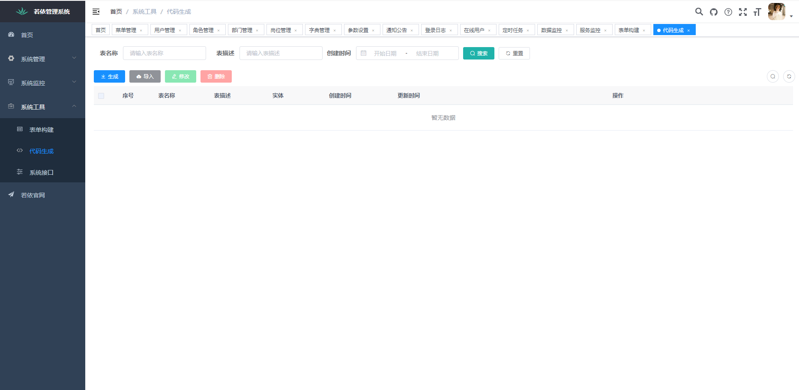

2.然后选择导入——>选择要生成的表（导入数据库中自己业务的表，注意系统自带的sys_开头的表不要生成！不要去替换项目中原有的代码！！！因为模板不一样，会造成启动不了！）

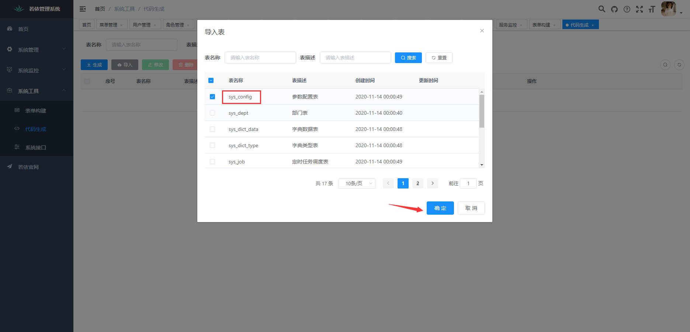
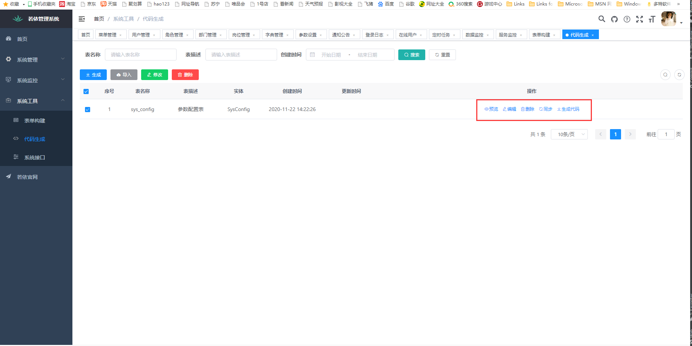

3.如果生成之前要更改信息，可以点击编辑进入更改

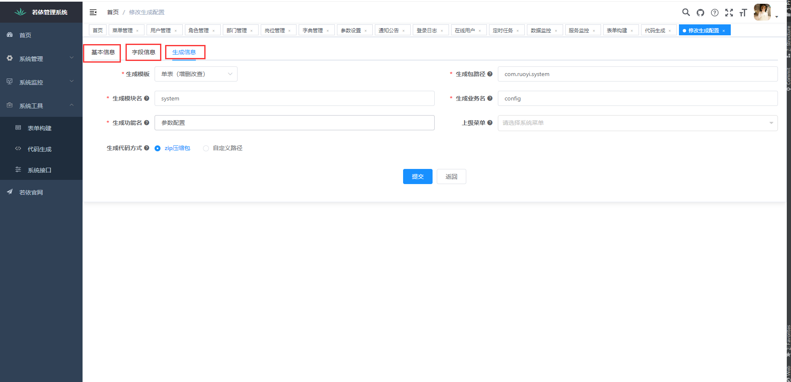

4.可以点击预览查看代码生成的效果

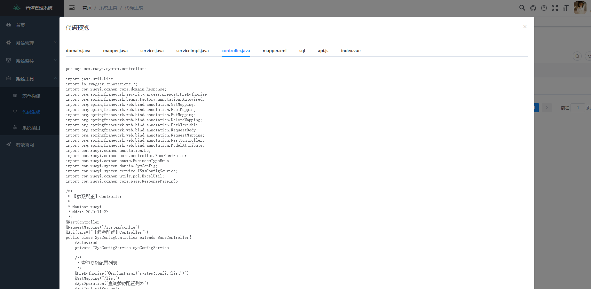

5.勾选然后可以点击生成（如果数据库中配好了comment注释，和table注释可以直接生成注释文字）

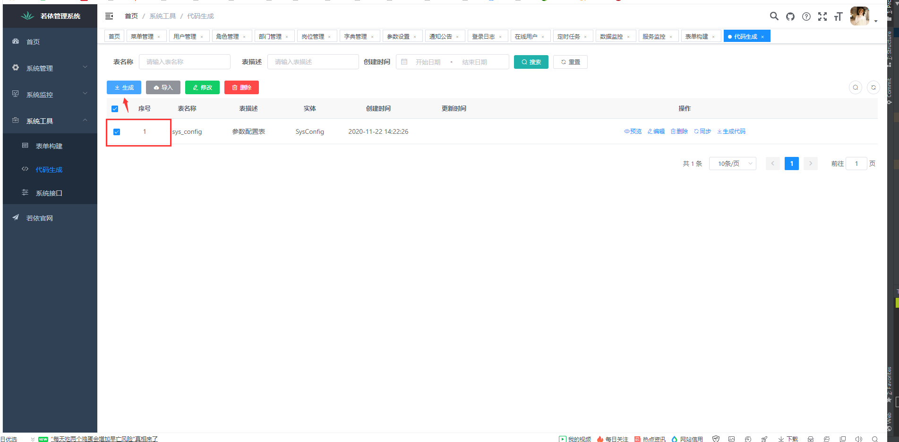

6.解压后可以看到代码生产结果,然后拷贝到项目中对应的文件夹即可——main是java代码，vue是前端代码，deptMenu.sql是在菜单表中添加一条菜单数据

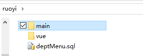

## 在线体验

- admin/admin123  

演示地址：http://vue.ruoyi.vip  
文档地址：http://doc.ruoyi.vip
~~~
com.ruoyi 
├──ruoyi-admin              //web服务入口Controller管理模块（业务表生成的Controller层代码可以放在这里的project包下面）
│         └──project        //这里写你的项目业务代码Controller
│         └──system         //系统自带Controller
│         └──启动类          //springboot项目启动类（默认启动地址http://localhost:8080）
├──ruoyi-common             //通用模块（通用工具类等）
├──ruoyi-framework          //框架核心模块（包含redis，druid，Log等）
├──ruoyi-generator          //代码生成器模块
├──ruoyi-quartz             //定时任务模块
├──ruoyi-system             //系统模块（javaBean,mapper,service等逻辑的模块，业务表生成的代码（除了controller）都可以放在这里的project包下面）
│         └──project        //这里写你的项目业务相关代码（除了Controller之外）
│         └──system         //系统自带功能
├──ruoyi-ui                 //前端项目Vue工程（默认启动地址http://localhost:81）
├──bin                      //服务器脚本文件夹
├──doc                      //说明文档文件夹
├──sql                      //sql脚本文件夹 
│   └──create_db.sql        //生成数据库和用户
│   └──create_business.sql  //用于存放你们自己业务表的sql
│   └──quartz.sql           //用于存放定时任务sql
│   └──ry_20201021.sql      //系统基本表自带的sql
├──pom.xml                  //项目整体依赖
~~~
## 演示图
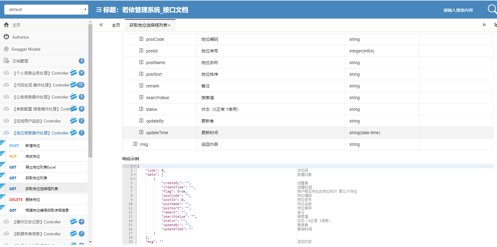

<table>
    <tr>
        <td></td>
        <td></td>
    </tr>
    <tr>
        <td></td>
        <td></td>
    </tr>
    <tr>
        <td></td>
        <td></td>
    </tr>
	<tr>
        <td></td>
        <td></td>
    </tr>	 
    <tr>
        <td></td>
        <td></td>
    </tr>
	<tr>
        <td></td>
        <td></td>
    </tr>
	<tr>
        <td></td>
        <td></td>
    </tr>
    <tr>
        <td></td>
        <td></td>
    </tr>
</table>

## Swagger使用：

1.未登录授权前，接口无法调试

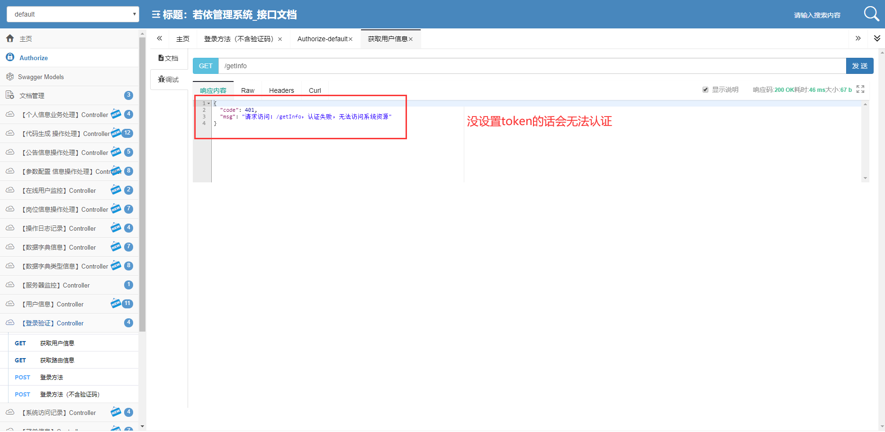

2.登录用法-用登录（免验证码）

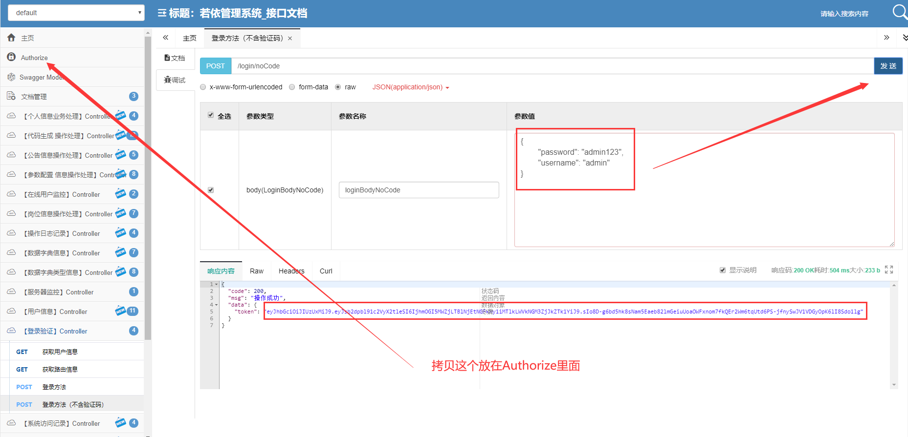

3.然后保存

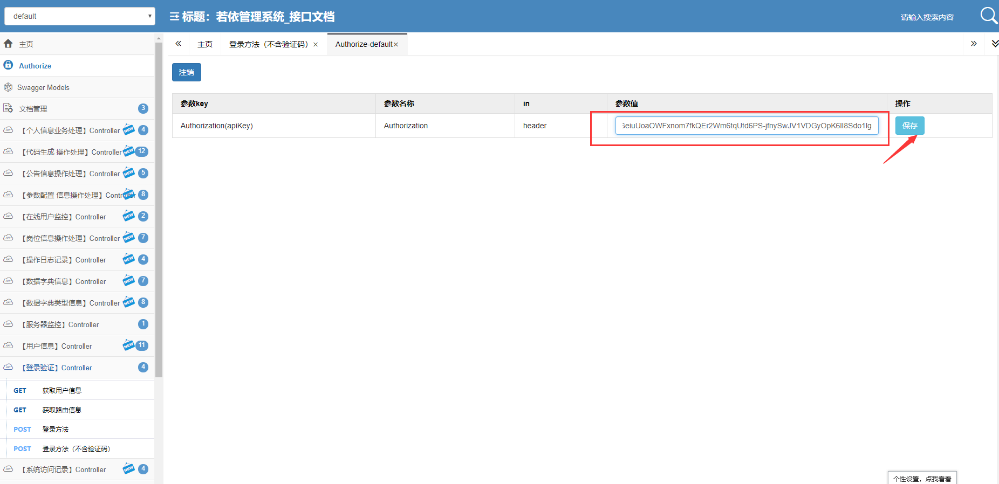

4.之后就能愉快的调试了

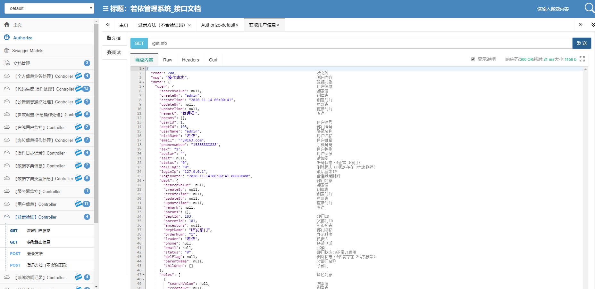


## 模板生成代码示例（局部）

1.后端代码生成示例（部分）

```java
package com.ruoyi.system.controller;

import java.util.List;
import io.swagger.annotations.*;
import com.ruoyi.common.core.domain.Response;
import org.springframework.security.access.prepost.PreAuthorize;
import org.springframework.beans.factory.annotation.Autowired;
import org.springframework.web.bind.annotation.GetMapping;
import org.springframework.web.bind.annotation.PostMapping;
import org.springframework.web.bind.annotation.PutMapping;
import org.springframework.web.bind.annotation.DeleteMapping;
import org.springframework.web.bind.annotation.PathVariable;
import org.springframework.web.bind.annotation.RequestBody;
import org.springframework.web.bind.annotation.RequestMapping;
import org.springframework.web.bind.annotation.RestController;
import org.springframework.web.bind.annotation.ModelAttribute;
import com.ruoyi.common.annotation.Log;
import com.ruoyi.common.core.controller.BaseController;
import com.ruoyi.common.enums.BusinessTypeEnum;
import com.ruoyi.system.domain.SysDept;
import com.ruoyi.system.service.ISysDeptService;
import com.ruoyi.common.utils.poi.ExcelUtil;
import com.ruoyi.common.core.page.ResponsePageInfo;

/**
 * 【部门】Controller
 *
 * @author ruoyi
 * @date 2020-11-22
 */
@RestController
@RequestMapping("/system/dept")
@Api(tags={"【部门】Controller"})
public class SysDeptController extends BaseController{
    @Autowired
    private ISysDeptService sysDeptService;

    /**
     * 查询部门列表
     */
    @PreAuthorize("@ss.hasPermi('system:dept:list')")
    @GetMapping("/list")
    @ApiOperation("查询部门列表")
    @ApiImplicitParams({
            @ApiImplicitParam(name = "pageNum",value = "当前页码" ,dataType = "int", paramType = "query", required = false),
            @ApiImplicitParam(name = "pageSize",value = "每页数据量" , dataType = "int", paramType = "query", required = false),
    })
    public ResponsePageInfo<SysDept> list(@ModelAttribute SysDept sysDept){
        startPage();
        List<SysDept> list = sysDeptService.selectSysDeptList(sysDept);
        return toResponsePageInfo(list);
    }

    /**
     * 导出部门列表
     */
    @PreAuthorize("@ss.hasPermi('system:dept:export')")
    @Log(title = "部门", businessType = BusinessTypeEnum.EXPORT)
    @GetMapping("/export")
    @ApiOperation("导出部门列表Excel")
    public Response<String> export(@ModelAttribute SysDept sysDept){
        List<SysDept> list = sysDeptService.selectSysDeptList(sysDept);
        ExcelUtil<SysDept> util = new ExcelUtil<SysDept>(SysDept.class);
        return util.exportExcel(list, "dept");
    }

    /**
     * 获取部门详细信息
     */
    @PreAuthorize("@ss.hasPermi('system:dept:query')")
    @GetMapping(value = "/{deptId}")
    @ApiOperation("获取部门详细信息")
    public Response<SysDept> getInfo(
            @ApiParam(name = "deptId", value = "部门参数", required = true)
            @PathVariable("deptId") Long deptId
    ){
        return Response.success(sysDeptService.selectSysDeptById(deptId));
    }

    /**
     * 新增部门
     */
    @PreAuthorize("@ss.hasPermi('system:dept:add')")
    @Log(title = "部门", businessType = BusinessTypeEnum.INSERT)
    @PostMapping
    @ApiOperation("新增部门")
    public Response<Integer> add(@RequestBody SysDept sysDept){
        return toResponse(sysDeptService.insertSysDept(sysDept));
    }

    /**
     * 修改部门
     */
    @PreAuthorize("@ss.hasPermi('system:dept:edit')")
    @Log(title = "部门", businessType = BusinessTypeEnum.UPDATE)
    @PutMapping
    @ApiOperation("修改部门")
    public Response<Integer> edit(@RequestBody SysDept sysDept){
        return toResponse(sysDeptService.updateSysDept(sysDept));
    }

    /**
     * 删除部门
     */
    @PreAuthorize("@ss.hasPermi('system:dept:remove')")
    @Log(title = "部门", businessType = BusinessTypeEnum.DELETE)
	@DeleteMapping("/{deptIds}")
    @ApiOperation("删除部门")
    public Response remove(
            @ApiParam(name = "deptIds", value = "部门ids参数", required = true)
            @PathVariable Long[] deptIds
    ){
        return toResponse(sysDeptService.deleteSysDeptByIds(deptIds));
    }
}


```
2.前端代码生成示例（部分）

```Javascript
import request from '@/utils/request'

// 查询部门列表
export function listDept(query) {
  return request({
    url: '/system/dept/list',
    method: 'get',
    params: query
  })
}

// 查询部门详细
export function getDept(deptId) {
  return request({
    url: '/system/dept/' + deptId,
    method: 'get'
  })
}

// 新增部门
export function addDept(data) {
  return request({
    url: '/system/dept',
    method: 'post',
    data: data
  })
}

// 修改部门
export function updateDept(data) {
  return request({
    url: '/system/dept',
    method: 'put',
    data: data
  })
}

// 删除部门
export function delDept(deptId) {
  return request({
    url: '/system/dept/' + deptId,
    method: 'delete'
  })
}

// 导出部门
export function exportDept(query) {
  return request({
    url: '/system/dept/export',
    method: 'get',
    params: query
  })
}
```
```vue
<template>
  <div class="app-container">
    <el-form :model="queryParams" ref="queryForm" :inline="true" v-show="showSearch" label-width="68px">
      <el-form-item label="父部门id" prop="parentId">
        <el-input
          v-model="queryParams.parentId"
          placeholder="请输入父部门id"
          clearable
          size="small"
          @keyup.enter.native="handleQuery"
        />
      </el-form-item>
      <el-form-item label="祖级列表" prop="ancestors">
        <el-input
          v-model="queryParams.ancestors"
          placeholder="请输入祖级列表"
          clearable
          size="small"
          @keyup.enter.native="handleQuery"
        />
      </el-form-item>
      <el-form-item label="部门名称" prop="deptName">
        <el-input
          v-model="queryParams.deptName"
          placeholder="请输入部门名称"
          clearable
          size="small"
          @keyup.enter.native="handleQuery"
        />
      </el-form-item>
      <el-form-item label="显示顺序" prop="orderNum">
        <el-input
          v-model="queryParams.orderNum"
          placeholder="请输入显示顺序"
          clearable
          size="small"
          @keyup.enter.native="handleQuery"
        />
      </el-form-item>
      <el-form-item label="负责人" prop="leader">
        <el-input
          v-model="queryParams.leader"
          placeholder="请输入负责人"
          clearable
          size="small"
          @keyup.enter.native="handleQuery"
        />
      </el-form-item>
      <el-form-item label="联系电话" prop="phone">
        <el-input
          v-model="queryParams.phone"
          placeholder="请输入联系电话"
          clearable
          size="small"
          @keyup.enter.native="handleQuery"
        />
      </el-form-item>
      <el-form-item label="邮箱" prop="email">
        <el-input
          v-model="queryParams.email"
          placeholder="请输入邮箱"
          clearable
          size="small"
          @keyup.enter.native="handleQuery"
        />
      </el-form-item>
      <el-form-item label="部门状态" prop="status">
        <el-select v-model="queryParams.status" placeholder="请选择部门状态" clearable size="small">
          <el-option label="请选择字典生成" value="" />
        </el-select>
      </el-form-item>
      <el-form-item>
        <el-button type="cyan" icon="el-icon-search" size="mini" @click="handleQuery">搜索</el-button>
        <el-button icon="el-icon-refresh" size="mini" @click="resetQuery">重置</el-button>
      </el-form-item>
    </el-form>

    <el-row :gutter="10" class="mb8">
      <el-col :span="1.5">
        <el-button
          type="primary"
          icon="el-icon-plus"
          size="mini"
          @click="handleAdd"
          v-hasPermi="['system:dept:add']"
        >新增</el-button>
      </el-col>
      <el-col :span="1.5">
        <el-button
          type="success"
          icon="el-icon-edit"
          size="mini"
          :disabled="single"
          @click="handleUpdate"
          v-hasPermi="['system:dept:edit']"
        >修改</el-button>
      </el-col>
      <el-col :span="1.5">
        <el-button
          type="danger"
          icon="el-icon-delete"
          size="mini"
          :disabled="multiple"
          @click="handleDelete"
          v-hasPermi="['system:dept:remove']"
        >删除</el-button>
      </el-col>
      <el-col :span="1.5">
        <el-button
          type="warning"
          icon="el-icon-download"
          size="mini"
          @click="handleExport"
          v-hasPermi="['system:dept:export']"
        >导出</el-button>
      </el-col>
	  <right-toolbar :showSearch.sync="showSearch" @queryTable="getList"></right-toolbar>
    </el-row>

    <el-table v-loading="loading" :data="deptList" @selection-change="handleSelectionChange">
      <el-table-column type="selection" width="55" align="center" />
      <el-table-column label="部门id" align="center" prop="deptId" />
      <el-table-column label="父部门id" align="center" prop="parentId" />
      <el-table-column label="祖级列表" align="center" prop="ancestors" />
      <el-table-column label="部门名称" align="center" prop="deptName" />
      <el-table-column label="显示顺序" align="center" prop="orderNum" />
      <el-table-column label="负责人" align="center" prop="leader" />
      <el-table-column label="联系电话" align="center" prop="phone" />
      <el-table-column label="邮箱" align="center" prop="email" />
      <el-table-column label="部门状态" align="center" prop="status" />
      <el-table-column label="操作" align="center" class-name="small-padding fixed-width">
        <template slot-scope="scope">
          <el-button
            size="mini"
            type="text"
            icon="el-icon-edit"
            @click="handleUpdate(scope.row)"
            v-hasPermi="['system:dept:edit']"
          >修改</el-button>
          <el-button
            size="mini"
            type="text"
            icon="el-icon-delete"
            @click="handleDelete(scope.row)"
            v-hasPermi="['system:dept:remove']"
          >删除</el-button>
        </template>
      </el-table-column>
    </el-table>

    <pagination
      v-show="total>0"
      :total="total"
      :page.sync="queryParams.pageNum"
      :limit.sync="queryParams.pageSize"
      @pagination="getList"
    />

    <!-- 添加或修改部门对话框 -->
    <el-dialog :title="title" :visible.sync="open" width="500px" append-to-body>
      <el-form ref="form" :model="form" :rules="rules" label-width="80px">
        <el-form-item label="父部门id" prop="parentId">
          <el-input v-model="form.parentId" placeholder="请输入父部门id" />
        </el-form-item>
        <el-form-item label="部门名称" prop="deptName">
          <el-input v-model="form.deptName" placeholder="请输入部门名称" />
        </el-form-item>
        <el-form-item label="显示顺序" prop="orderNum">
          <el-input v-model="form.orderNum" placeholder="请输入显示顺序" />
        </el-form-item>
        <el-form-item label="负责人" prop="leader">
          <el-input v-model="form.leader" placeholder="请输入负责人" />
        </el-form-item>
        <el-form-item label="联系电话" prop="phone">
          <el-input v-model="form.phone" placeholder="请输入联系电话" />
        </el-form-item>
        <el-form-item label="邮箱" prop="email">
          <el-input v-model="form.email" placeholder="请输入邮箱" />
        </el-form-item>
        <el-form-item label="部门状态">
          <el-radio-group v-model="form.status">
            <el-radio label="1">请选择字典生成</el-radio>
          </el-radio-group>
        </el-form-item>
        <el-form-item label="删除标志" prop="delFlag">
          <el-input v-model="form.delFlag" placeholder="请输入删除标志" />
        </el-form-item>
      </el-form>
      <div slot="footer" class="dialog-footer">
        <el-button type="primary" @click="submitForm">确 定</el-button>
        <el-button @click="cancel">取 消</el-button>
      </div>
    </el-dialog>
  </div>
</template>

<script>
import { listDept, getDept, delDept, addDept, updateDept, exportDept } from "@/api/system/dept";

export default {
  name: "Dept",
  data() {
    return {
      // 遮罩层
      loading: true,
      // 选中数组
      ids: [],
      // 非单个禁用
      single: true,
      // 非多个禁用
      multiple: true,
      // 显示搜索条件
      showSearch: true,
      // 总条数
      total: 0,
      // 部门表格数据
      deptList: [],
      // 弹出层标题
      title: "",
      // 是否显示弹出层
      open: false,
      // 查询参数
      queryParams: {
        pageNum: 1,
        pageSize: 10,
        parentId: null,
        ancestors: null,
        deptName: null,
        orderNum: null,
        leader: null,
        phone: null,
        email: null,
        status: null,
      },
      // 表单参数
      form: {},
      // 表单校验
      rules: {
      }
    };
  },
  created() {
    this.getList();
  },
  methods: {
    /** 查询部门列表 */
    getList() {
      this.loading = true;
      listDept(this.queryParams).then(response => {
        this.deptList = response.rows;
        this.total = response.total;
        this.loading = false;
      });
    },
    // 取消按钮
    cancel() {
      this.open = false;
      this.reset();
    },
    // 表单重置
    reset() {
      this.form = {
        deptId: null,
        parentId: null,
        ancestors: null,
        deptName: null,
        orderNum: null,
        leader: null,
        phone: null,
        email: null,
        status: "0",
        delFlag: null,
        createBy: null,
        createTime: null,
        updateBy: null,
        updateTime: null
      };
      this.resetForm("form");
    },
    /** 搜索按钮操作 */
    handleQuery() {
      this.queryParams.pageNum = 1;
      this.getList();
    },
    /** 重置按钮操作 */
    resetQuery() {
      this.resetForm("queryForm");
      this.handleQuery();
    },
    // 多选框选中数据
    handleSelectionChange(selection) {
      this.ids = selection.map(item => item.deptId)
      this.single = selection.length!==1
      this.multiple = !selection.length
    },
    /** 新增按钮操作 */
    handleAdd() {
      this.reset();
      this.open = true;
      this.title = "添加部门";
    },
    /** 修改按钮操作 */
    handleUpdate(row) {
      this.reset();
      const deptId = row.deptId || this.ids
      getDept(deptId).then(response => {
        this.form = response.data;
        this.open = true;
        this.title = "修改部门";
      });
    },
    /** 提交按钮 */
    submitForm() {
      this.$refs["form"].validate(valid => {
        if (valid) {
          if (this.form.deptId != null) {
            updateDept(this.form).then(response => {
              this.msgSuccess("修改成功");
              this.open = false;
              this.getList();
            });
          } else {
            addDept(this.form).then(response => {
              this.msgSuccess("新增成功");
              this.open = false;
              this.getList();
            });
          }
        }
      });
    },
    /** 删除按钮操作 */
    handleDelete(row) {
      const deptIds = row.deptId || this.ids;
      this.$confirm('是否确认删除部门编号为"' + deptIds + '"的数据项?', "警告", {
          confirmButtonText: "确定",
          cancelButtonText: "取消",
          type: "warning"
        }).then(function() {
          return delDept(deptIds);
        }).then(() => {
          this.getList();
          this.msgSuccess("删除成功");
        })
    },
    /** 导出按钮操作 */
    handleExport() {
      const queryParams = this.queryParams;
      this.$confirm('是否确认导出所有部门数据项?', "警告", {
          confirmButtonText: "确定",
          cancelButtonText: "取消",
          type: "warning"
        }).then(function() {
          return exportDept(queryParams);
        }).then(response => {
          this.download(response.data);
        })
    }
  }
};
</script>

```

